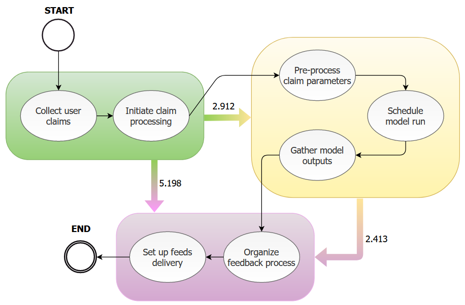

# Transitive Performance Miner

A tool for deriving process performance knowledge by event log analysis.
Implementation is in form of
[ProM 6 Framework](https://www.promtools.org/doku.php?id=gettingstarted:start)
plug-in.

## Functionality

<p align="center">
  " width="65%"/>
</p>

`TODO` description.

## Prerequisites

ProM plug-in development requires custom third-party JARs usage, and the
recommended way to contribute is to setup an Eclipse environment. Necessary
dependencies are meant to be managed via Ivy. Preferred option is to install an
IvyDE Eclipse addon and manipulate the dependencies by XML configs. Please refer
to the following sources as how to configure Ivy and adjust the environment:

- [Basic Ivy + IvyDE usage](http://runningexample.blogspot.com/2014/02/Using-Ivy-for-dependency-management.html)
- [ProM discussion on packages 1](https://www.win.tue.nl/promforum/discussion/1128/compile-a-package)
- [ProM discussion on packages 2](https://www.win.tue.nl/promforum/discussion/1257/which-jar-should-i-import-manually)

Although IvyDE should be enough for retrieving all the required packages, it
came out that a manual "Ant + Ivy" JAR installation was needed in order to build
the project. For more information, check out
[link](https://stackoverflow.com/questions/12677816/ant-target-failing-antlib-or-ivy-issue).

## Compilation and build

By default, `compileSources` target is being run, which includes Ivy
dependencies resolving, compilation and JAR generation. Therefore, executing

```
ant
```

is enough to build.

## ProM Integration

By default, ProM 6.10 uses Java 8, so make sure you compile plugin sources with
the corresponding Java version. In Eclipse, it is done via setting individual
project settings under "Java Compiler" preferences section (compliance settings
set to `1.8`).

To launch the framework with custom plugin included, run Eclipse launch config
XML `ProM with UITopia (TransitivePerformanceMiner).launch`.

This will lead to plugin dependencies resolving (with local caching) and then
the framework will show up. Plugin should be available among the standard ones
in the "Actions" section.

## Standard ProM plugins examples

Existing analytical solutions were taken for insights to implement this one.
They are available at public ProM packages
[repository](https://svn.win.tue.nl/trac/prom/browser/Packages?order=name).

For developer convenience, they can be checked out with

`svn checkout http://svn.win.tue.nl/repos/prom/Packages/<NAME>/Trunk`

## Troubleshooting

For any questions, suggestions, or bug reporting please refer to the
[issues](https://github.com/kostmetallist/transitive-performance-miner/issues)
page.
