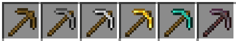

# Versioning

The versioning of this project was inspired by Android custom names for
releases. I've noted a relationship between the target of this plugin and
a process of extracting valuable resources from the mine. That's why tags
in `main` are assigned the names of materials used for pickaxes in some voxel
game:

- `wooden`
- `stone`
- `iron`
- `gold`
- `diamond`
- `netherite`

