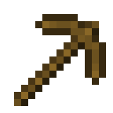
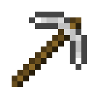
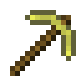
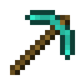
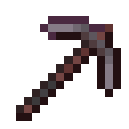

# Versioning

*Ok, let's bring a pinch of puerility whilst preserving a formal approach*

---

A new version is assigned whenever a set of significant improvements is made for
the plugin. Increments are applied for minor versions only. Patches are allowed
but not necessary to track. Minor versions are associated with codenames.

The idea for picking mnemonic names originally comes from Android's version
codenames for earlier releases (Gingerbread, Jelly Bean, etc.). There is a
notable relationship between the name of this plugin and a process of extracting
valuable resources from the mine — the latter can be performed in a very popular
computer game about mining implemented on Java. So, version tags in `main`
branch are thereby named after the materials used for pickaxes sorted by their
rarity.

Below is the mapping table representing versions and corresponding plugin
features:

| Icon                                                                     | Codename    | Features |
| ------------------------------------------------------------------------ | ----------- | -------- |
| 

    | `wooden`    | Basic XES log export, MW-BGM application, filtering and MCN build support |
| 

     | `stone`     | Cuter GUI, in/out colored nodes in MCN, parallelized processing |
| 

      | `iron`      | ???      |
| 

    | `golden`    | ???      |
| 

   | `diamond`   | ???      |
| 

 | `netherite` | ???      |
